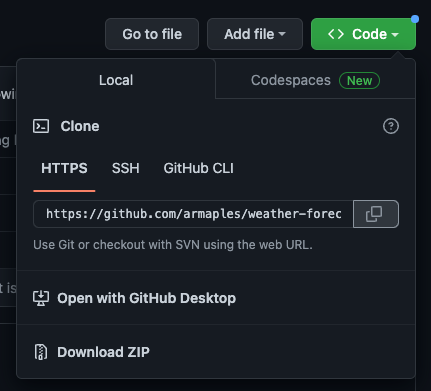

# Weather Forecast

## Description
 This project provides a simple weather forecast based on user input. The motivation was to create a page that could be accessed from any device to quickly check the weather for the city the user types in. 

## Table of Contents

- [Installation](#installation)
- [Application Preview](#application-preview)
- [Languages Used](#languages-used)
- [Important Links](#important-links)
- [Credits](#credits)
- [License](#license)
    - [MIT License](#mit-license)

## Installation

- Navigate to the 'clone' button on the github repository and use either SSH or HTTPS link to clone the repository to your computer.

- On your computer, navigate to the 'weather-forecast' directory and open the index.html file in your browser. 

## Application Preview

- Above is a screenshot of what the page looks like after you search for a city.

## Known Issues/Bugs

- When you click on a city in the search history, the page of the last saved city will show up, no matter which button you click. 

## Languages Used

- HTML
- CSS
- Javascript
- jQuery
- jQuery UI

## Important Links

- [Github Repository](https://github.com/armaples/weather-forecast)
- [Deployed Application](https://armaples.github.io/weather-forecast)

## Credits
- [Professional README Guide](https://coding-boot-camp.github.io/full-stack/github/professional-readme-guide) 
- [Choose A License](https://choosealicense.com/licenses/mit/)
- [Adobe Fonts](https://fonts.adobe.com/)

## License

### MIT License

Copyright (copy) 2022 Weather Forecast - Alyssa Maples

Permission is hereby granted, free of charge, to any person obtaining a copy
of this software and associated documentation files (the "Software"), to deal
in the Software without restriction, including without limitation the rights
to use, copy, modify, merge, publish, distribute, sublicense, and/or sell
copies of the Software, and to permit persons to whom the Software is
furnished to do so, subject to the following conditions:

The above copyright notice and this permission notice shall be included in all
copies or substantial portions of the Software.

THE SOFTWARE IS PROVIDED "AS IS", WITHOUT WARRANTY OF ANY KIND, EXPRESS OR
IMPLIED, INCLUDING BUT NOT LIMITED TO THE WARRANTIES OF MERCHANTABILITY,
FITNESS FOR A PARTICULAR PURPOSE AND NONINFRINGEMENT. IN NO EVENT SHALL THE
AUTHORS OR COPYRIGHT HOLDERS BE LIABLE FOR ANY CLAIM, DAMAGES OR OTHER
LIABILITY, WHETHER IN AN ACTION OF CONTRACT, TORT OR OTHERWISE, ARISING FROM,
OUT OF OR IN CONNECTION WITH THE SOFTWARE OR THE USE OR OTHER DEALINGS IN THE
SOFTWARE.